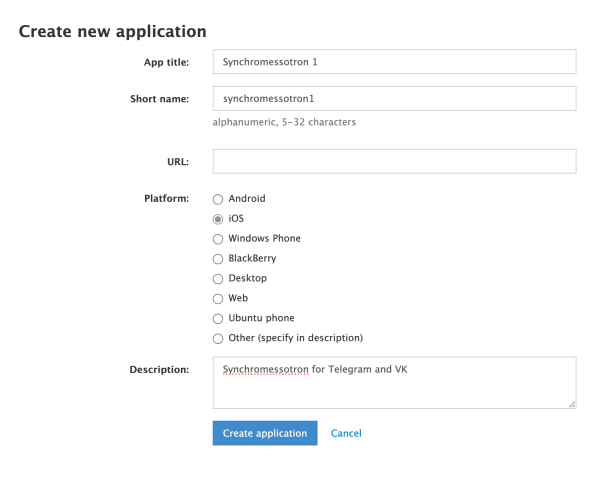

# Synchromessotron

> **🚧 Work in progress.** The project is under active development. Steps 1–5 of the setup guide below are complete and usable. Steps 6–8 (VK credentials, config file, emulator testing) are still being written and verified.

A Firebase-hosted scheduled service that synchronizes messages between messenger accounts.

## What it does

Synchromessotron runs as a Firebase Cloud Function on a configurable cron schedule. On each run it:

1. Reads messages from each configured source account/dialog since the last sync.
2. Writes (reposts or forwards) those messages to the paired target account/dialog.
3. Saves the current timestamp to Firestore so the next run continues where it left off.

Supported messengers: **Telegram** (via Telethon) · **VK.com** (via vk_api)

## Prerequisites

| Tool | Version | Purpose |
|---|---|---|
| Python | 3.11+ | Runtime |
| Node.js / npm | LTS | Firebase CLI |
| Firebase CLI | latest | Deploy & emulator |
| Firebase project | — | Firestore + Cloud Functions |

## Local Setup

```bash
git clone https://github.com/your-org/synchromessotron.git
cd synchromessotron
python3 -m venv .venv && source .venv/bin/activate
pip install -e ".[dev]"
```

## Configuration

Your personal `config.yaml` is **excluded from version control** (listed in `.gitignore`) because it contains your account IDs. Never commit it.

See the full setup guide below — it walks you through every step from scratch.

---

## Full Setup Guide

This guide takes you from zero to a locally running sync service. It assumes you are comfortable with the terminal and Python, but have not used Firebase, Telegram's developer tools, or VK's API before.

---

### Step 1 — Run Unit Tests

This is the first thing to do after cloning the repo. Unit tests verify the core logic of the service — the sync algorithm, error handling, and the Telegram and VK read/write logic — using mocked API calls. **No real credentials, no Firebase project, no internet connection are needed.** If all tests pass, you know the code is working correctly on your machine before touching any external services.

```bash
pytest tests/unit/
```

You should see 21 tests pass. If any fail, do not proceed — check that dependencies installed correctly (`pip install -e ".[dev]"`) and that you are running Python 3.11 or later.

---

### Step 2 — Create a Firebase Project

1. Go to the [Firebase Console](https://console.firebase.google.com/) and sign in with a Google account.
2. Click **Create a new Firebase project** and enter a name, e.g. `synchromessotron`.
3. Disable Google Analytics when prompted — it is not needed. Click on "Create project".
4. Wait for the project to be provisioned, then click **Continue**.

---

### Step 3 — Enable Firestore

Firestore stores the timestamp of the last successful sync so the service knows where to continue after each run.

1. Expand left sidebar of the Firebase Console. Click **Build → Firestore Database**.
2. Click **Firestore database**, after that **Create a database"
3. After that on Step 1 select "Standard edition"-
4. On step 2 don't set a Database ID and select a Cloud Firestore location closest to you (e.g. `eur3 (Europe)`).
5. On step 3 set "Start in production mode" and click on "Create".


You do not need to manually create any collections or documents — the service creates them automatically on first run. You will use these two names in your `config.yaml`:

| Config key | Value |
|---|---|
| `sync_state.collection` | `synchromessotron` |
| `sync_state.document` | `state` |

---

### Step 4 — Install the Firebase CLI

```bash
npm install -g firebase-tools
firebase login          # opens a browser — sign in with the same Google account
firebase use --project YOUR_FIREBASE_PROJECT_ID (e.g. synchromessotron)
```

You should see in terminal something like:

Active Project: synchromessotron

---

### Step 5 — Get Your Telegram Credentials

The service authenticates as your Telegram **user account** (not a bot). You need three things: an `api_id`, an `api_hash`, and a session string.

#### 5a. Create a Telegram application

1. Open <https://my.telegram.org/apps> in a browser and sign in with your phone number.
2. Click **API development tools**.
3. Fill in the **Create new application** form. The App title and Short name can be anything, e.g. `synchromessotron` / `syncbot`. Platform can be left as `Other`.

   

4. Click **Create application**.
5. You will see your **App api_id** (a number) and **App api_hash** (a long hex string). Note both values — you will need them in step 5c.

   

#### 5b. Generate a session string

This is a one-time step that authorises the service to act as your account.

First, export your credentials as environment variables (replace the placeholders):

```bash
export TG_API_ID="12345"
export TG_API_HASH="your_api_hash_here"
```

Then write the script to a file and run it (a heredoc closes stdin, which breaks interactive prompts):

```bash
source .venv/bin/activate
cat > /tmp/tg_session.py << 'PYEOF'
import asyncio, os
from telethon import TelegramClient
from telethon.sessions import StringSession
from telethon.errors import SessionPasswordNeededError

async def main():
    api_id = int(os.environ["TG_API_ID"])
    api_hash = os.environ["TG_API_HASH"]
    phone = os.environ["TG_PHONE"]
    client = TelegramClient(StringSession(), api_id, api_hash)
    await client.connect()
    await client.send_code_request(phone)
    code = input("Enter the code Telegram sent to your app: ")
    try:
        await client.sign_in(phone, code)
    except SessionPasswordNeededError:
        password = input("Enter your 2FA password: ")
        await client.sign_in(password=password)
    print("\nYour session string (copy it — treat it like a password):")
    print(client.session.save())
    await client.disconnect()

asyncio.run(main())
PYEOF
export TG_PHONE="+1234567890"   # your Telegram phone number with country code
python3 /tmp/tg_session.py
```

The script will:
1. Send a confirmation code to your Telegram app — type it when prompted.
2. If you have Two-Step Verification enabled, also ask for your **2FA password**.

> **What is the 2FA password?** It is a password *you chose yourself* when you enabled Two-Step Verification in Telegram. Telegram uses it as an extra layer of security when logging in on a new device. To check, change, or disable it: open Telegram on your phone → **Settings → Privacy and Security → Two-Step Verification**. If you forgot it, tap **Forgot password?** there — Telegram will send a recovery link to your email.

The script prints a long string — copy the entire line. **Treat it like a password.**

#### 5c. Build the credential JSON

Combine all three values into a single JSON string and export it:

```bash
export TG_CREDS='{"api_id": 12345, "api_hash": "your_api_hash_here", "session": "your_session_string_here"}'
```

Replace the placeholders with your real values. The value is a JSON object inside a shell string — make sure it is on one line with no extra spaces.

#### 5d. List your dialogs and pick the one to sync

The repo includes a setup helper at `tools/tg_check.py`. Run it to confirm your credentials work and to see all your Telegram dialogs with their numeric IDs:

```bash
python3 tools/tg_check.py list
```

Example output:

```
✓ Logged in as: Your Name (@yourhandle, id=123456789)

  TYPE         ID                 NAME
  ------------ ------------------ ---------------------------------------------
  User         123456789          Your Name  @yourhandle
  Channel      -1001234567890     Family Group  @familygroup
  Chat         -987654321         Old Project
  User         555000             Telegram
```

Note the **ID** of the group you want to sync — you will need it in Step 7. Copy it exactly, including the minus sign for groups and channels.

**What the type column means:**

| Type | What it is |
|---|---|
| `Channel` | A Telegram channel or supergroup (large/public groups) |
| `Chat` | A regular group chat |
| `User` | A direct message conversation with a person |

#### 5e. Verify read and write access to your chosen dialog

Once you know the dialog ID, verify that the credentials can read messages and send to it:

```bash
python3 tools/tg_check.py test -1001234567890
```

Replace `-1001234567890` with your actual dialog ID. The tool will:
1. Print the last 3 messages from the dialog so you can confirm it is the right one.
2. Ask if you want to send a test message — type something and press Enter, or just press Enter to skip.

Example output:

```
✓ Dialog: Family Group  (id=-1001234567890)

  Last 3 messages (oldest first):
  ------------------------------------------------------------
  [2026-03-10 14:22] Alice: Did you see the news?
  [2026-03-10 14:23] Bob: Yes, crazy stuff
  [2026-03-10 14:25] Alice: Indeed
  ------------------------------------------------------------

Send a test message (press Enter to skip): Hello from Synchromessotron!
✓ Message sent.
```

If both commands succeed, your Telegram credentials are fully working. Note the dialog ID — you will use it in `config.yaml` in Step 7.

---

### Step 6 — Get Your VK.com Credentials

The service authenticates as your VK **user account** using an access token. You need to create a VK application to obtain one.

#### 6a. Create a VK standalone application

1. Go to <https://vk.com/editapp?act=create> (you must be logged in to VK).
2. Enter a title (e.g. `Synchromessotron`), choose **Standalone application**, and click **Connect application**.
3. Confirm via SMS if prompted.
4. You will see your application settings page. Note the **Application ID** (a number).

> Save your screenshot here: [docs/images/vk-01-create-app.png](docs/images/vk-01-create-app.png)

#### 6b. Obtain an access token via OAuth

Open the following URL in your browser, replacing `YOUR_APP_ID` with your Application ID:

```
https://oauth.vk.com/authorize?client_id=YOUR_APP_ID&display=page&redirect_uri=https://oauth.vk.com/blank.html&scope=messages&response_type=token&v=5.199
```

VK will ask you to authorise the application. After you click **Allow**, the browser redirects to a blank page. The access token is in the URL bar — it looks like:

```
https://oauth.vk.com/blank.html#access_token=LONG_TOKEN_HERE&expires_in=0&user_id=123456789
```

Copy the value after `access_token=` (up to, but not including, `&expires_in`).

> Save your screenshot here: [docs/images/vk-02-oauth-token.png](docs/images/vk-02-oauth-token.png)

You will also need your VK **user_id** — it is visible in the URL above as `user_id=123456789`.

#### 6c. Build the credential JSON

```bash
export VK_CREDS='{"token": "your_vk_access_token_here"}'
```

#### 6d. Find the VK peer_id for the conversation to sync

`peer_id` identifies which VK conversation to read from or write to.

| Conversation type | peer_id |
|---|---|
| Direct message with a user | That user's VK numeric ID |
| Multi-chat (group conversation) | `2000000000 + chat_id` |

The easiest way to find a user's numeric ID: open their VK profile in a browser. The URL will be either `vk.com/id123456789` (the number is their ID) or a custom URL like `vk.com/username` — in that case, right-click their avatar, copy the image URL, and find the numeric ID there. Alternatively, paste their profile URL into <https://vk.com/dev/get_user_id>.

For a quick local test you can sync messages to your own account: use the `user_id` shown in the OAuth redirect URL above.

---

### Step 7 — Create Your Configuration File

`config.yaml` is listed in `.gitignore` and will never be committed to your repository.

```bash
cp config.yaml.example config.yaml
```

Open `config.yaml` and fill in your values:

```yaml
sync_state:
  collection: synchromessotron
  document: state

sync_pairs:
  # Telegram → VK
  - source:
      messenger: telegram
      account_id: "me"           # "me" = your Saved Messages (good for testing)
      credentials_ref: TG_CREDS  # name of the env var you exported in Step 5c
    target:
      messenger: vk
      account_id: "123456789"    # the peer_id you found in Step 6d
      credentials_ref: VK_CREDS  # name of the env var you exported in Step 6c
    write_strategy: repost

  # VK → Telegram (reverse direction)
  - source:
      messenger: vk
      account_id: "123456789"
      credentials_ref: VK_CREDS
    target:
      messenger: telegram
      account_id: "me"
      credentials_ref: TG_CREDS
    write_strategy: repost
```

Then tell the service where to find the file:

```bash
export SYNCHROMESSOTRON_CONFIG="$PWD/config.yaml"
```

---

### Step 8 — Test Locally with the Firebase Emulator

The Firebase emulator runs Firestore and Cloud Functions on your machine with no deployment needed.

```bash
firebase emulators:start
```

The local UIs open at:
- **Emulator UI:** <http://localhost:4000>
- **Firestore:** <http://localhost:8080>
- **Functions:** <http://localhost:5001>

To trigger the sync manually while the emulator is running, open a second terminal:

```bash
source .venv/bin/activate
export SYNCHROMESSOTRON_CONFIG="$PWD/config.yaml"
export FIRESTORE_EMULATOR_HOST=localhost:8080
python3 -c "import asyncio; from functions.main import _run_sync; asyncio.run(_run_sync())"
```

Open the Emulator UI at <http://localhost:4000/firestore> to confirm that a document was created at `synchromessotron/state` and that its `timestamp` field was set. Check your Telegram Saved Messages and VK conversation to verify that messages arrived.

You can also run the Firestore integration tests with the emulator running:

```bash
FIRESTORE_EMULATOR_HOST=localhost:8080 pytest tests/integration/
```

---

## Deployment to Production

Once local testing is successful:

1. Store your credentials as secrets in [Firebase Secret Manager](https://console.cloud.google.com/security/secret-manager):
   - Create a secret named `TG_CREDS` with the JSON value from Step 5c.
   - Create a secret named `VK_CREDS` with the JSON value from Step 6c.

2. Deploy the function:

   ```bash
   firebase deploy --only functions
   ```

3. Validate the first scheduled execution in [Google Cloud Logging](https://console.cloud.google.com/logs). Look for log entries from `synchromessotron`.

---

## Architecture

See [DEVELOPMENT.md](DEVELOPMENT.md) for the full architecture overview and developer guide.

## License

MIT
