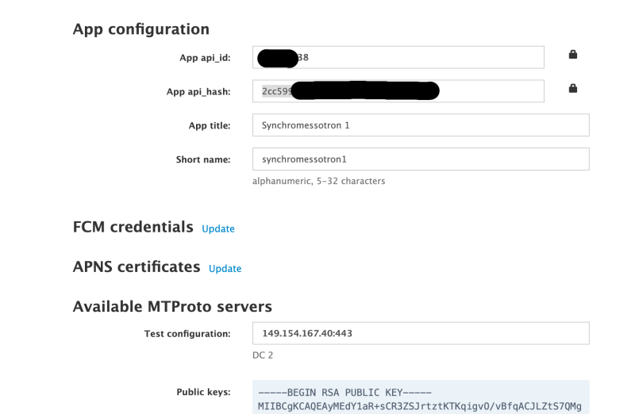

# telegram-cli — User Manual

This manual explains how to install and use **telegram-cli** — a command-line tool that lets you back up, read, and manage your Telegram messages without the official app. You do not need to be a programmer. Just follow the steps in order.

---

Telegram is one of the most widely used messengers in the world, with over 900 million monthly active users across dozens of languages and countries.

| Language | ISO 639‑1 | Top Countries | Estimated Telegram Users |
|----------|-----------|---------------|--------------------------|
| Russian | ru | Russia, Ukraine, Belarus | ≈ 120–150 million |
| English | en | India, USA, UK | ≈ 110–130 million |
| Persian (Farsi) | fa | Iran, Afghanistan, Tajikistan | ≈ 40–50 million |
| Turkish | tr | Turkey, Cyprus, Germany (diaspora) | ≈ 25–35 million |
| Arabic | ar | Egypt, Iraq, Saudi Arabia | ≈ 20–30 million |
| German | de | Germany, Austria, Switzerland | ≈ 8–12 million |

Telegram can sometimes be unavailable or blocked in certain countries or geographical regions. In these cases, telegram-cli can help — it allows you to work with your Telegram data from the command line, independently of the official apps.

It is especially useful for **offline processing** of Telegram content — for example, backing up conversations, groups, and channels for later analysis with AI tools or other automation.

You do not need to be a programmer to use this tool. Just follow the steps below.

---

## Contents

- [Getting Started — Windows Quick Start](#getting-started--windows-quick-start)
- [Overview — What Can telegram-cli Do?](#overview--what-can-telegram-cli-do)
- [Setup Checklist](#setup-checklist)
- [How to Install](#how-to-install)
- [Security — Protecting Your Credentials](#security--protecting-your-credentials)
- [Where Your Files Are Saved](#where-your-files-are-saved)
- [Command Reference](#command-reference)
- [Error Handling](#error-handling)
- [Advanced](#advanced)
- [Troubleshooting](#troubleshooting)

---

## Getting Started — Windows Quick Start

> This section is for **Windows users** who downloaded `telegram-cli.exe`. If you are on macOS or use the Python variant, skip to [Setup Checklist](#setup-checklist).

Here are the five commands you need to go from zero to your first backup. Each command is explained in detail later in this manual.

**Before you begin:** Download `telegram-cli.exe` and this user manual as described in [How to Install](#how-to-install). Then place `telegram-cli.exe` in a folder of your choice — for example, `C:\Users\YourName\telegram-cli\`. Open Command Prompt in that folder (see [How to open Command Prompt](#how-to-open-command-prompt-windows-or-terminal-macos) below).

**Step 1 — Get your API credentials** from <https://my.telegram.org/apps> (one-time, see [Step 2](#step-2--create-a-telegram-application) for details).

**Step 2 — Log in:**
```
telegram-cli init
```
Enter your `api_id`, `api_hash`, and phone number when prompted. Type the login code sent to your Telegram app.

**Step 3 — Verify:**
```
telegram-cli whoami
```
You should see your name and phone number.

**Step 4 — List your conversations:**
```
telegram-cli get-dialogs
```
Find the ID of the conversation you want to back up (the number in the `ID` column).

**Step 5 — Back up:**
```
telegram-cli backup -1001234567890 --limit=500
```
Replace `-1001234567890` with the actual ID from Step 4. Your messages are saved to a `synchromessotron\` folder in the current directory.

> **SmartScreen warning on first run:** Windows may show _"Windows protected your PC"_. Click **More info** → **Run anyway**. This happens once.

---

## Overview — What Can telegram-cli Do?

| Command | What it does |
|---------|-------------|
| `init` | Set up credentials and session |
| `whoami` | Validate session and show user info |
| `ping` | Check Telegram availability |
| `get-dialogs` | List your conversations |
| `backup` | Full or incremental message backup |
| `send` | Send a message to a conversation |
| `edit` | Edit a previously sent message |
| `delete` | Delete your own messages |
| `download-media` | Download a photo, video, or file from a message |
| `help` | Show help in your language |
| `version` | Show version information |

> **What is a "dialog"?** In Telegram, a "dialog" means any conversation — a private chat with a person, a group chat, or a channel.

---

## Setup Checklist

To use telegram-cli, complete these four steps once:

- [ ] **Step 1** — Download the file for your platform.
- [ ] **Step 2** — Create a Telegram application to get your API credentials.
- [ ] **Step 3** — Set up your session — telegram-cli logs you in.
- [ ] **Step 4** — Verify the setup is working.

The sections below walk you through each step in detail.

---

## How to Install

### Step 1 — Choose your variant and download

Go to the [Releases](https://github.com/vsirotin/synchromessotron/releases/) page, find the latest stable version, open "Assets", and download the file for your platform:

| Platform | File | Extra software needed? |
|----------|------|------------------------|
| **Windows** | `telegram-cli.exe` | No |
| **macOS** | `telegram-cli-macos.zip` | No |
| **Any (Python)** | `telegram-cli.pyz` | Yes — Python ≥ 3.11 |

Put the downloaded file in a folder of your choice — for example, a `telegram-cli` folder on your Desktop or in your home directory.

> **Which variant should I choose?**
>
> - **Windows or macOS** — use the platform-specific file. No extra software needed.
> - **Python variant** — choose this if you want to inspect the code before running it: `.pyz` is a standard Python zip archive you can open and read. It also works on Linux.

**Platform-specific first-run notes:**

- **Windows:** The first time you run the file, SmartScreen may show _"Windows protected your PC"_. Click **More info** → **Run anyway**. This happens once only.
- **macOS:** After unzipping, open Terminal in the folder and run these two commands once:
  ```
  chmod +x telegram-cli
  xattr -d com.apple.quarantine telegram-cli
  ```
  This removes the macOS download quarantine and makes the file runnable.
- **Python variant:** Requires Python 3.11 or newer. Check with `python3 --version`. If needed, install Python from <https://www.python.org/downloads/>.

### Step 2 — Create a Telegram application

To use telegram-cli you need your own Telegram API credentials. This is a one-time setup — you will never need to repeat it.

1. Open <https://my.telegram.org/apps> in a browser and sign in with your Telegram phone number.
2. Click **API development tools**.
3. Fill in the **Create new application** form. The App title and Short name can be anything you like, e.g. `synchromessotron` / `syncbot`. Platform can be left as `Other`.

   

4. Click **Create application**.
5. You will see your **App api_id** (a short number) and **App api_hash** (a long string of letters and digits). Keep this browser tab open — you will need both values in the next step.

   

### How to open Command Prompt (Windows) or Terminal (macOS)

You will need a Command Prompt (Windows) or Terminal (macOS) window open in the folder where you saved the telegram-cli file.

> **Windows — open Command Prompt in your folder:**
>
> 1. Open **File Explorer** and navigate to the folder where you saved `telegram-cli.exe`.
> 2. Click the address bar at the top (it shows the folder path).
> 3. Type `cmd` and press **Enter**. A black Command Prompt window opens, already in that folder.

> **macOS — open Terminal in your folder:**
>
> 1. Open **Finder** and navigate to the folder where you saved `telegram-cli`.
> 2. Right-click (or Control-click) the folder.
> 3. Select **New Terminal at Folder**. A Terminal window opens in that folder.
>
> (If you do not see that option: go to **System Settings → Privacy & Security → Extensions → Finder Extensions** and enable **New Terminal at Folder**.)

### Step 3 — Set up your session

Open Command Prompt (Windows) or Terminal (macOS) in the folder where you placed the file (see above), and run:

| Platform | Command |
|----------|---------|
| **Windows** | `telegram-cli init` |
| **macOS** | `./telegram-cli init` |
| **Python** | `python3 telegram-cli.pyz init` |

The command will:
1. Ask for your **api_id**, **api_hash**, and **phone number** (from Step 2).
2. Send a login code to your Telegram app — type it when prompted.
3. If you have Two-Step Verification enabled, ask for your **2FA password**.
4. Create a `config.yaml` file with your credentials and session.

> **What is the 2FA password?** It is a password *you set yourself* when you turned on Two-Step Verification in Telegram. To check or change it: open Telegram → **Settings → Privacy and Security → Two-Step Verification**.

**Expected result:**

```
✓ Session created and saved to config.yaml
  Run 'telegram-cli whoami' to verify.
```

### Step 4 — Verify the setup

| Platform | Command |
|----------|---------|
| **Windows** | `telegram-cli whoami` |
| **macOS** | `./telegram-cli whoami` |
| **Python** | `python3 telegram-cli.pyz whoami` |

**Expected result:**

```
✓ Session valid
  User ID:   123456789
  Name:      Your Name
  Username:  @yourhandle
  Phone:     +1234567890
```

If you see an error instead, check the [Error Handling](#error-handling) section below.

Also verify that Telegram is reachable:

| Platform | Command |
|----------|---------|
| **Windows** | `telegram-cli ping` |
| **macOS** | `./telegram-cli ping` |
| **Python** | `python3 telegram-cli.pyz ping` |

**Expected result:**

```
✓ Telegram is reachable (42.3 ms)
```

---

## Security — Protecting Your Credentials

The `config.yaml` file that telegram-cli creates contains your Telegram API credentials and your login session. **Anyone who has this file can access your Telegram account.**

**Rules:**

1. **Never share `config.yaml` with anyone.** Treat it like a password.
2. **Never upload it to the internet** — do not put it on GitHub, Google Drive, Dropbox, email, or any shared location.
3. **Keep it only in the same folder as the telegram-cli file** on your own computer.
4. **If you think someone may have seen your `config.yaml`** — immediately revoke the session in Telegram: go to **Settings → Devices** (or **Settings → Privacy and Security → Active Sessions**) and end the suspicious session. Then run `telegram-cli init` again to create a new one.

> The file `config.yaml.example` is a template with no real credentials — it is safe to share.

---

## Where Your Files Are Saved

All data produced by telegram-cli (backups, downloaded media) is stored in an **output folder**.

### Default location

By default, a folder called `synchromessotron` is created inside the folder where you run telegram-cli:

```
<current folder>/synchromessotron/
```

### Choosing a different folder

You can choose a different location with `--outdir`:

| Platform | Example |
|----------|---------|
| **Windows** | `telegram-cli backup -1001234567890 --outdir=C:\MyBackups` |
| **macOS** | `./telegram-cli backup -1001234567890 --outdir=/Users/yourname/MyBackups` |
| **Python** | `python3 telegram-cli.pyz backup -1001234567890 --outdir=/path/to/my/data` |

> **Conflict rule:** If both `--outdir` and `output_dir` in `config.yaml` are set and they point to different paths, the command exits with an error. Remove one of them to resolve the conflict.

telegram-cli checks that the folder can be written to before starting. Most locations on your Desktop or in your home folder already have write permission. If you get a "write permission" error, see [Troubleshooting](#troubleshooting).

### How your conversations are organised

For each conversation, a sub-folder is created using this naming rule:

```
<first 10 characters of name>_<conversation ID>
```

- Spaces in the name are replaced with underscores (`_`).
- If the name is shorter than 10 characters, the full name is used.

| Conversation | Sub-folder |
|--------------|------------|
| `Мемуары кочевого программиста. Байки, были, думы` (ID -718738386) | `Мемуары_ко_718738386` |
| `Telegram` (ID 777000) | `Telegram_777000` |

Inside each conversation folder, messages are organised by year, and then by month or day if there are many messages (see [Advanced](#advanced) for details).

### What files are saved

At each level, two files are created:

| File | Content |
|------|---------|
| `messages.json` | Full message data (for use with other tools). |
| `messages.md` | Author, date, and message text — easy to read in any text editor. |

### Saving photos, videos, and other content

By default only messages are saved. To include other content, add flags to the `backup` command:

| Flag | What is saved |
|------|---------------|
| `--media` | Photos and videos |
| `--files` | Documents and file attachments |
| `--music` | Audio tracks |
| `--voice` | Voice messages |
| `--links` | Link previews and URLs |
| `--gifs` | GIF animations |
| `--members` | List of conversation participants |

Example — back up messages and photos:

| Platform | Command |
|----------|---------|
| **Windows** | `telegram-cli backup -1001234567890 --media` |
| **macOS** | `./telegram-cli backup -1001234567890 --media` |
| **Python** | `python3 telegram-cli.pyz backup -1001234567890 --media` |

Example — back up everything:

```
telegram-cli backup -1001234567890 --media --files --music --voice --links --gifs --members
```

### Example folder structure

After running `backup` with `--media --members`:

```
synchromessotron/
├── Мемуары_ко_718738386/
│   ├── members/
│   ├── 2025/
│   │   ├── 01/
│   │   │   ├── messages.json
│   │   │   ├── messages.md
│   │   │   └── media/
│   │   └── 02/
│   │       ├── messages.json
│   │       └── messages.md
│   └── 2026/
│       ├── messages.json
│       └── messages.md
└── Telegram_777000/
    └── 2026/
        ├── messages.json
        └── messages.md
```

In this example:
- "Мемуары кочевого…" had more than 50 messages in 2025, so it was split into monthly sub-folders. In 2026 there were fewer messages, so they stay together in the year folder.
- "Telegram" had few messages overall — no monthly split needed.

---

## Command Reference

### get-dialogs — List your conversations

```
get-dialogs [--limit=N] [--outdir=DIR]
```

**Parameters:**

| Parameter | Default | Description |
|-----------|---------|-------------|
| `--limit` | 100 | Maximum number of conversations to return. Use `--limit=500` or higher to get more. |
| `--outdir` | — | Also save `dialogs.json` to this folder (see [Where Your Files Are Saved](#where-your-files-are-saved)). |

**Examples:**

| Platform | Command |
|----------|---------|
| **Windows** | `telegram-cli get-dialogs --limit=50` |
| **macOS** | `./telegram-cli get-dialogs --limit=50` |
| **Python** | `python3 telegram-cli.pyz get-dialogs --limit=50` |

**Expected result:**

```
  TYPE         ID                 NAME
  ------------ ------------------ ------------------------------------------
  User         123456789          Your Name  @yourhandle
  Channel      -1001234567890     Family Group  @familygroup
  Chat         -987654321         Old Project

3 dialogs found.
```

With `--outdir`, the table is still printed to the screen and `dialogs.json` is also saved to the output folder.

If something goes wrong: `NETWORK_ERROR`, `PERMISSION_DENIED`, `RATE_LIMITED`, `SESSION_INVALID`. See [Error Handling](#error-handling).

---

### backup — Back up messages

```
backup <dialog_id> [--since=TIMESTAMP] [--upto=TIMESTAMP] [--limit=N] [--outdir=DIR]
       [--media] [--files] [--music] [--voice] [--links] [--gifs] [--members]
       [--estimate] [--count]
```

**Parameters:**

| Parameter | Default | Description |
|-----------|---------|-------------|
| `<dialog_id>` | — | Conversation ID (required). Use `get-dialogs` to find it. |
| `--since` | — | Only download messages sent **after** this date and time (format: `2026-01-01T00:00:00+00:00`). |
| `--upto` | — | Only download messages sent **on or before** this date and time. |
| `--limit` | 100 | Maximum number of messages to download. |
| `--outdir` | `./synchromessotron` | Save files to this folder instead of the default. |
| `--media` | off | Also download photos and videos. |
| `--files` | off | Also download documents and file attachments. |
| `--music` | off | Also download audio tracks. |
| `--voice` | off | Also download voice messages. |
| `--links` | off | Also save link previews and URLs. |
| `--gifs` | off | Also download GIF animations. |
| `--members` | off | Also save the list of conversation participants. |
| `--estimate` | off | Show how long the backup will take, then stop. Nothing is downloaded. |
| `--count` | off | Show how many messages and files exist, then stop. Nothing is downloaded. |

**Examples:**

| Platform | Command |
|----------|---------|
| **Windows** | `telegram-cli backup -1001234567890 --limit=500` |
| **macOS** | `./telegram-cli backup -1001234567890 --limit=500` |
| **Python** | `python3 telegram-cli.pyz backup -1001234567890 --limit=500` |

**Expected result** (messages only):

```
✓ 500 messages saved to synchromessotron/Telegram_777000/2026/
```

**Expected result** (with `--media --files`):

```
✓ 500 messages saved to synchromessotron/Telegram_777000/2026/
✓ 23 media files downloaded
✓ 7 documents downloaded
```

**Incremental backup** — only messages after a date:

```
telegram-cli backup -1001234567890 --since=2026-03-01
```

**Expected result:**

```
✓ 12 messages saved to synchromessotron/Telegram_777000/2026/03/
```

**Time window** — messages between two dates (`--since` must be earlier than `--upto`):

```
telegram-cli backup -1001234567890 ^
    --since=2026-01-01T00 ^
    --upto=2026-01-01T10
```

> **Common mistake:** Setting `--since` to a date *after* `--upto` results in 0 messages saved, because no message can be both after February and before January. Always check that `--since` is an earlier date than `--upto`.

**Time estimate before a large backup:**

```
telegram-cli backup -1001234567890 --limit=5000 --estimate
```

**Expected result:**

```
≈ 12 minutes (5000 messages, estimated 2.4 ms per message)
```

The estimate is approximate — actual time depends on your internet speed and Telegram limits. Nothing is downloaded.

**Count messages before downloading:**

```
telegram-cli backup -1001234567890 --count
```

**Expected result:**

```
Messages: 350 total
  photo: 42
  link/webpage: 8
  video: 5
  file/document: 2
```

If something goes wrong: `ENTITY_NOT_FOUND`, `NETWORK_ERROR`, `PERMISSION_DENIED`, `RATE_LIMITED`. See [Error Handling](#error-handling).

---

### send — Send a message

```
send <dialog_id> --text=TEXT
```

**Parameters:**

| Parameter | Description |
|-----------|-------------|
| `<dialog_id>` | Conversation ID (required). |
| `--text` | The text to send (required). |

**Examples:**

| Platform | Command |
|----------|---------|
| **Windows** | `telegram-cli send -1001234567890 --text="Hello from CLI!"` |
| **macOS** | `./telegram-cli send -1001234567890 --text="Hello from CLI!"` |
| **Python** | `python3 telegram-cli.pyz send -1001234567890 --text="Hello from CLI!"` |

**Expected result:**

```
✓ Message sent
  ID:    12345
  Date:  2026-03-16 14:30:00
  Text:  Hello from CLI!
```

If something goes wrong: `ENTITY_NOT_FOUND`, `PERMISSION_DENIED`, `RATE_LIMITED`. See [Error Handling](#error-handling).

---

### edit — Edit a message

```
edit <dialog_id> <message_id> --text=TEXT
```

**Parameters:**

| Parameter | Description |
|-----------|-------------|
| `<dialog_id>` | Conversation ID (required). |
| `<message_id>` | Message ID (required). |
| `--text` | New message text (required). |

**Examples:**

| Platform | Command |
|----------|---------|
| **Windows** | `telegram-cli edit -1001234567890 42 --text="Corrected text"` |
| **macOS** | `./telegram-cli edit -1001234567890 42 --text="Corrected text"` |
| **Python** | `python3 telegram-cli.pyz edit -1001234567890 42 --text="Corrected text"` |

**Expected result:**

```
✓ Message edited
  ID:    42
  Date:  2026-03-16 14:30:00
  Text:  Corrected text
```

If something goes wrong: `ENTITY_NOT_FOUND`, `NOT_MODIFIED`, `PERMISSION_DENIED`. See [Error Handling](#error-handling).

---

### delete — Delete messages

```
delete <dialog_id> <message_id> [<message_id> ...]
```

**Parameters:**

| Parameter | Description |
|-----------|-------------|
| `<dialog_id>` | Conversation ID (required). |
| `<message_id>` | One or more message IDs (required). |

**Examples:**

| Platform | Command |
|----------|---------|
| **Windows** | `telegram-cli delete -1001234567890 42 43 44` |
| **macOS** | `./telegram-cli delete -1001234567890 42 43 44` |
| **Python** | `python3 telegram-cli.pyz delete -1001234567890 42 43 44` |

**Expected result:**

```
✓ 3 messages deleted
```

If something goes wrong: `ENTITY_NOT_FOUND`, `PERMISSION_DENIED`. See [Error Handling](#error-handling).

---

### download-media — Download a photo, video, or file

```
download-media <dialog_id> <message_id> [--outdir=DIR]
```

**Parameters:**

| Parameter | Default | Description |
|-----------|---------|-------------|
| `<dialog_id>` | — | Conversation ID (required). |
| `<message_id>` | — | Message ID (required). |
| `--outdir` | `./synchromessotron` | Save to this folder instead of the default. |

The file is saved into the appropriate sub-folder (`media/`, `files/`, `music/`, `voice/`, `gifs/`) inside the conversation's folder.

**Examples:**

| Platform | Command |
|----------|---------|
| **Windows** | `telegram-cli download-media -1001234567890 42` |
| **macOS** | `./telegram-cli download-media -1001234567890 42` |
| **Python** | `python3 telegram-cli.pyz download-media -1001234567890 42` |

**Expected result:**

```
✓ Downloaded: synchromessotron/Telegram_777000/2026/03/media/photo_42.jpg (2.1 MB)
```

If something goes wrong: `ENTITY_NOT_FOUND`, `NETWORK_ERROR`, `PERMISSION_DENIED`. See [Error Handling](#error-handling).

---

### ping — Check if Telegram is reachable

```
ping
```

No parameters.

**Examples:**

| Platform | Command |
|----------|---------|
| **Windows** | `telegram-cli ping` |
| **macOS** | `./telegram-cli ping` |
| **Python** | `python3 telegram-cli.pyz ping` |

**Expected result:**

```
✓ Telegram is reachable (42.3 ms)
```

If something goes wrong: `NETWORK_ERROR`. See [Error Handling](#error-handling).

---

### whoami — Check your login

```
whoami
```

No parameters.

**Examples:**

| Platform | Command |
|----------|---------|
| **Windows** | `telegram-cli whoami` |
| **macOS** | `./telegram-cli whoami` |
| **Python** | `python3 telegram-cli.pyz whoami` |

**Expected result:**

```
✓ Session valid
  User ID:   123456789
  Name:      Your Name
  Username:  @yourhandle
  Phone:     +1234567890
```

If something goes wrong: `AUTH_FAILED`, `SESSION_INVALID`. See [Error Handling](#error-handling).

---

### help — Show help in your language

```
help [LANG] [COMMAND]
```

**Parameters:**

| Parameter | Default | Description |
|-----------|---------|-------------|
| `LANG` | `en` | Language code. Supported: `en`, `ru`, `fa`, `tr`, `ar`, `de`. |
| `COMMAND` | — | If given, show help only for that command. |

**Examples:**

| Platform | Command |
|----------|---------|
| **Windows** | `telegram-cli help de backup` |
| **macOS** | `./telegram-cli help de backup` |
| **Python** | `python3 telegram-cli.pyz help de backup` |

**Expected result** (general, English):

```
telegram-cli — command-line tool for Telegram

Commands:
  init            Set up credentials and session
  whoami          Validate session and show user info
  ping            Check Telegram availability
  get-dialogs     List your dialogs
  backup          Full or incremental message backup
  send            Send a message
  edit            Edit a previously sent message
  delete          Delete own messages
  download-media  Download media from a message
  help            Show this help
  version         Show version information

Run 'telegram-cli help <lang> <command>' for details.
```

---

### version — Show version information

```
version
```

No parameters.

**Examples:**

| Platform | Command |
|----------|---------|
| **Windows** | `telegram-cli version` |
| **macOS** | `./telegram-cli version` |
| **Python** | `python3 telegram-cli.pyz version` |

**Expected result:**

```json
{
  "cli": { "version": "1.0.0", "build": 1, "datetime": "2026-03-17T00:00:00Z" },
  "lib": { "version": "1.2.0", "build": 3, "datetime": "2026-03-18T00:00:00Z" }
}
```

---

## Error Handling

When something goes wrong, telegram-cli prints a message describing the problem and what you can do about it.

Example:

```
Error [RATE_LIMITED]: Too many requests — retry after 30s
  retry_after: 30
```

**What each error means and what to do:**

| Error | What happened | What to do |
|-------|---------------|------------|
| `AUTH_FAILED` | Your Telegram account has been deactivated or banned. | Contact Telegram support. |
| `ENTITY_NOT_FOUND` | The conversation or message ID you used does not exist. | Use `get-dialogs` to find the correct ID. |
| `INTERNAL_ERROR` | An unexpected error occurred inside telegram-cli. | Report the problem and include the full error message. |
| `NETWORK_ERROR` | telegram-cli cannot reach Telegram. | Check your internet connection or try again later. |
| `NOT_MODIFIED` | You tried to edit a message, but the new text is the same as the old one. | Use different text. |
| `PERMISSION_DENIED` | You do not have permission to read from or write to this conversation. | Check your access rights for that conversation. |
| `RATE_LIMITED` | You sent too many requests in a short time; Telegram asks you to wait. | Wait the number of seconds shown in the error message, then try again. |
| `SESSION_INVALID` | Your login session has expired or was revoked. | Run `telegram-cli init` again to log back in. |

## Exit Codes

When telegram-cli finishes, it returns a number to the operating system (useful for scripts):

| Code | Meaning |
|------|---------|
| 0 | Everything worked. |
| 1 | You used a wrong command or parameter. |
| 2 | A Telegram error occurred (see the table above). |

---

## Advanced

### Controlling folder depth with `--split_threshold`

By default, messages are grouped into yearly folders. If a year contains many messages, telegram-cli automatically creates monthly sub-folders inside it, then daily, hourly, and finally per-minute sub-folders if needed.

The threshold that triggers a deeper split is controlled by `--split_threshold` (default: `100`). For example, if you run a backup with `--split_threshold=20`, a new sub-folder level is created whenever a folder would contain more than 20 messages.

```
telegram-cli backup -1001234567890 --split_threshold=20
```

This is useful if you want finer-grained organisation for very active conversations. For most users the default value is fine.

The depth follows this order:

```
year/ → month/ → day/ → hour/ → minute/
```

Messages are always stored at the deepest level — never split across two levels.

---

## Troubleshooting

### telegram-cli cannot reach Telegram

If you see `NETWORK_ERROR`, Telegram is unreachable from your computer.

**Try these steps in order:**

1. Check that your internet connection is working (open a website in your browser).
2. Try again a few minutes later — Telegram may have a temporary outage.
3. If Telegram is blocked in your region, consider using a VPN.
4. Run `telegram-cli ping` to confirm whether the problem is with the connection or with your session.

---

### Write permission error

If telegram-cli says it cannot write to the output folder, your user account does not have permission to create files there.

**Simplest fix for most users:** Run telegram-cli from your home folder or Desktop, or use `--outdir` to point to a folder in your home directory. Those locations always have write permission.

**Windows — check and grant write permission:**

Right-click the target folder → **Properties** → **Security** tab → check that your user has **Write** permission. If not, click **Edit**, select your user, and check the **Write** box.

For advanced users, the same can be done in Command Prompt:

```
icacls "C:\path\to\folder"
```

Look for `(W)` or `(F)` next to your username. To grant write permission:

```
icacls "C:\path\to\folder" /grant %USERNAME%:W
```

**macOS / Linux — check and grant write permission:**

Most folders in your home directory (Desktop, Documents, Downloads) already have write permission. If you use a custom path, check it with:

```
ls -ld /path/to/folder
```

If `w` is missing from the permissions, grant it with:

```
chmod u+w /path/to/folder
```

---

### Login code not arriving

If you did not receive a login code after running `telegram-cli init`:

1. Make sure the phone number you entered is correct and includes the country code (e.g. `+12125550100`).
2. Check your Telegram app — the code arrives as a regular Telegram message from the official Telegram account.
3. Wait a minute and try running `telegram-cli init` again.

---

### Session expired

If you see `SESSION_INVALID`, your login has expired or was revoked (for example, if you ended all active sessions in Telegram settings).

Run `telegram-cli init` to log in again.
